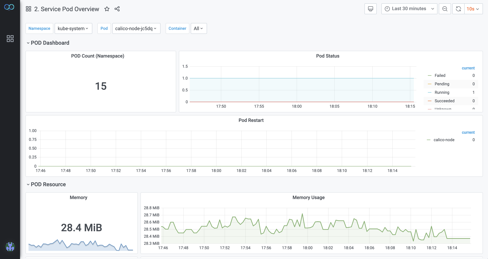

# 监控模块

## 1.用户管理

管理员和普通用户都要进行登录。

管理员可以增加和删除用户。

## 2.查看监控数据

用户可以查看以下三类指标数据。

### 2.1 Kubernetes集群指标数据

包括：集群告警数、服务数、Pod数、中间件数、集群运行时间、集群CPU/内存使用量等。

### 2.2 服务指标数据

包括：服务运行时间、CPU/内存使用量、重启次数、每个容器属于哪个Pod、每个Pod属于哪个服务等。

### 2.3 API网关指标数据

包括：API网关数、外部请求成功率统计、外部请求数等。
